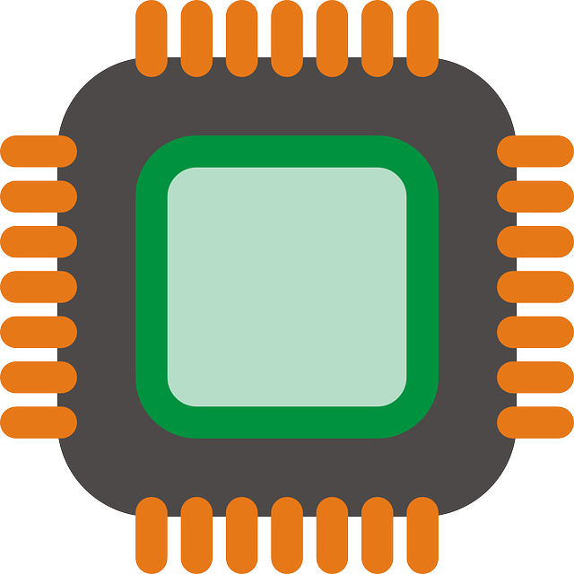
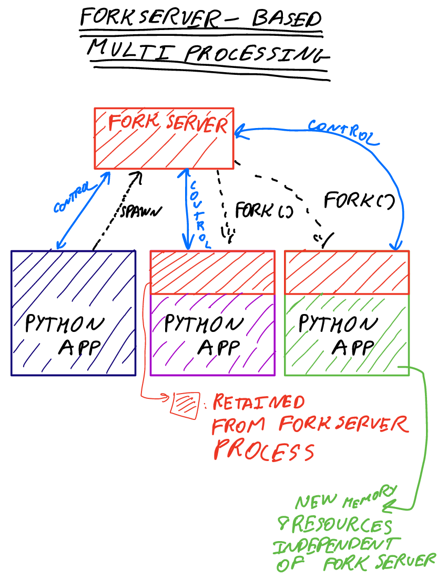
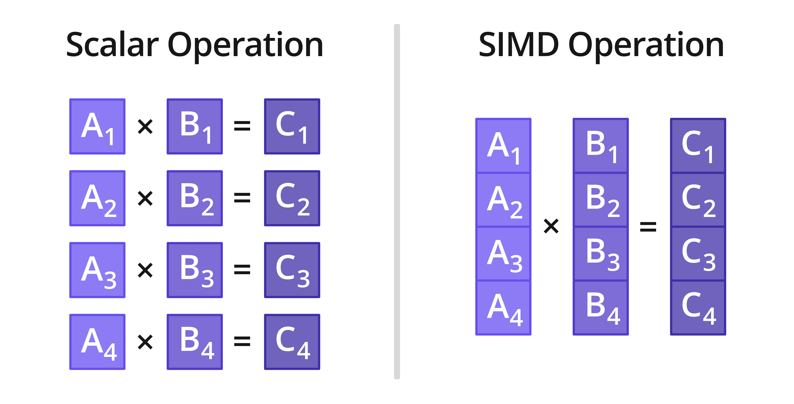
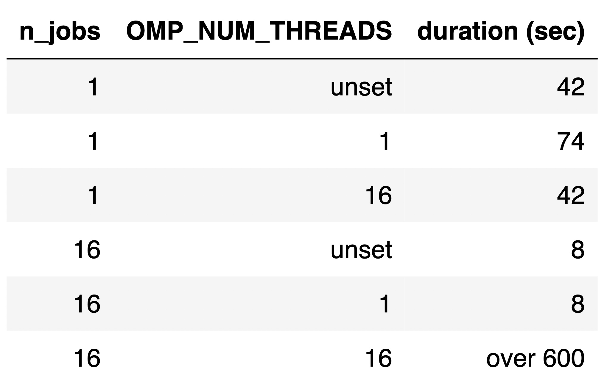
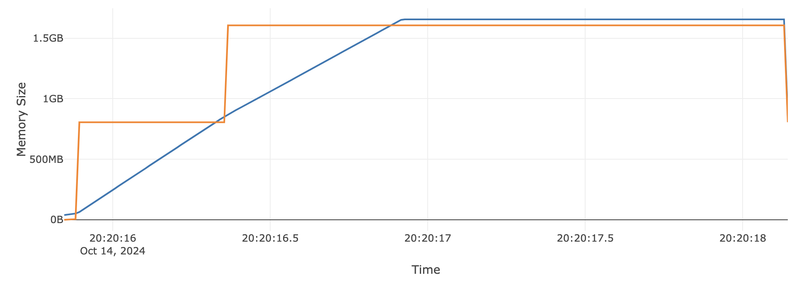
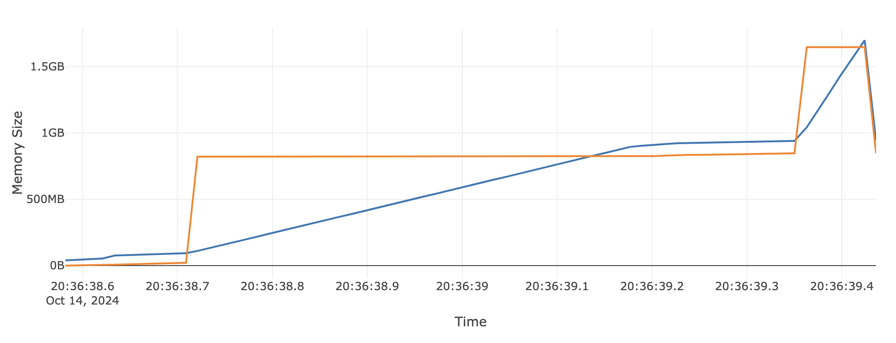

title: Accelerate Python with Parallelism
use_katex: False
class: title-slide

# Accelerate Python with Parallelism


.larger[Thomas J. Fan]<br>
<a href="https://www.github.com/thomasjpfan" target="_blank" class="title-link"><span class="icon icon-github right-margin"></span>@thomasjpfan</a>
<a class="this-talk-link", href="https://github.com/thomasjpfan/2024-accelerate-python-with-parallelism" target="_blank">github.com/thomasjpfan/2024-accelerate-python-with-parallelism</a>

---

class: top

<br>

# Me

- Senior Machine Engineer @ Union.ai

.center[

]

--

- Maintainer for scikit-learn

.center[

]

---

# Agenda 📓

- Parallelism Methods 🧪
- Profiling 🔎
- Future 🔮 (Free-threading & Sub-interpreters)

---

# Constraints

.g.g-middle.g-center[
.g-4[
## CPU & Compute Bound

]
.g-4[
## Linux

]
.g-4[
## Python

]
]

---

# Python's Global Interpreter Lock (GIL) 🔐
.g.g-middle[
.g-8[
## Prevents Python objects from being accessed at the same time
]
.g-4[

]
]

---

# Parallelism Methods 🧪

## Multi-processing 🚀
## Multi-threading 🧵

---

# Multi-processing 🚀

.g.g-middle[
.g-8[
## Linux `fork`: Copy-on-write semantics
]
.g-4[

]
]

---

# Python Multi-Processing 🚀
## Fork

.center[

]

.footnote-back[
[Source](https://bnikolic.co.uk/blog/python/parallelism/2019/11/13/python-forkserver-preload.html)
]

---

# Python Multi-Processing 🚀

.g.g-middle[
.g-6[
## Issues

- ❌ Reference counting
- ❌ Parent process state (threadpools)
]
.g-6.g-center[

]
]

---

# Python Multi-Processing 🚀
## Spawn

.center[

]

.footnote-back[
[Source](https://bnikolic.co.uk/blog/python/parallelism/2019/11/13/python-forkserver-preload.html)
]

---

# Python Multi-Processing 🚀

.g[
.g-6[
<br><br><br><br><br>
## Forkserver
- `set_forkserver_preload`
]
.g-6.g-center[

]
]

.footnote-back[
[Source](https://bnikolic.co.uk/blog/python/parallelism/2019/11/13/python-forkserver-preload.html)
]

---

# Examples of Multi-Processing
## Python Standard Library (Pool) 🎱

```python
from multiprocessing import Pool

def f(x):
    return x * x

if __name__ == "__main__":
    with Pool(processes=4) as pool:
        out = pool.map(f, range(10))
        print(out)

```

---

# Examples of Multi-Processing
## Python Standard Library (Futures) 🔮

```python
from concurrent.futures import ProcessPoolExecutor, as_completed
from tqdm import tqdm

def f(x):
    return x * x

if __name__ == "__main__":
    items = list(range(10))

    with ProcessPoolExecutor(max_workers=4) as executor:
        futures = [executor.submit(f, i) for i in items]
        for future in tqdm(as_completed(futures), total=len(items)):
            result = future.result()
            # Use result
```

---

# Examples of Multi-Processing
## Python Standard Library

- `multiprocessing.Pool`
- `concurrent.futures.ProcessPoolExecutor`

## Data sharing: Pickle 🥒

---

## Data sharing: Pickle 🥒

.center[

]

---

# Examples of Multi-Processing

.g.g-middle[
.g-8[
## scikit-learn

```python
from sklearn.experimental import enable_halving_search_cv
from sklearn.model_selection import HalvingRandomSearchCV

search_cv = HalvingRandomSearchCV(
    estimator,
*   n_jobs=8,
)

search_cv.fit(X, y)
```
]
.g-4[

]
]


## Data sharing: `cloudpickle` & memmap for data

---

# Examples of Multi-Processing
## scikit-learn (memmep)


---

# Examples of Multi-Processing

.g[
.g-8[
## PyTorch DataLoader

```python
from torch.utils.data import DataLoader

dataloader = DataLoader(... num_workers=8)

for x_batch, y_batch in dataloader:
    ...

```
]
.g-4[

]
]

## Data sharing: Pickle & memmap for tensors

---

# Examples of Multi-Processing

.g[
.g-8[
## Dask

`dask worker <address> --nworkers 8`

## Data sharing: Cloudpickle
]
.g-4[

]
]

---

# Examples of Multi-Processing
## Ray (Multi-Processing)

.g[
.g-8[
`ray start --address<address> --num-cpus=8`

## Data sharing: Plasma object store
- `cloudpickle` + memmap for data
]
.g-4[

]
]

---

# Multi-Threading

## Linux `pthreads`

.center[

]

---

class: top

<br><br><br><br>

# Standard Library (Multi-threading)

## `multiprocessing.pool.ThreadPool`
## `concurrent.futures.ThreadPoolExecutor`

--

<br>

## 🚨 Global Interpreter Lock (GIL)
## 🚨 Data shared between threads

---

# 🚨 Global Interpreter Lock (GIL)


---

class: top

<br><br><br>

# GIL - Solution
## Release the GIL! ⛓️‍💥

--

## `sklearn.ensemble.RandomForestClassifier`

```python
trees = Parallel(
    n_jobs=self.n_jobs, ... prefer="threads",
)(
*   delayed(_parallel_build_trees)(...)
    for i, t in enumerate(trees)
)
```

---

class: top

<br><br>

# What releases the GIL? ⛓️‍💥

- NumPy
- PyTorch
- scikit-learn (Sometimes)

--

## User defined

```python
search_cv = HalvingRandomSearchCV(estimator, n_jobs=8)
```

--

## Library defined

```python
forest = RandomForestRegressor(n_jobs=8)
```

---

class: top

<br><br><br>

# 🚨 Data shared between threads

## fit: Embarrassingly Parallel

```python
forest = RandomForestRegressor(n_jobs=8)
forest.fix(X, y)
```

<br>

--

## predict: Requires lock

```python
X_pred = forest.predict(X)
```

---

class: top

<br><br><br>

# 🚨 Data shared between threads

```python
def predict(self, X):
    lock = threading.Lock()

    Parallel(n_jobs=n_jobs, ..., require="sharedmem")(
        delayed(_accumulate_prediction)(e.predict, X, [y_hat], lock)
        for e in self.estimators_
    )
```

--

```python
def _accumulate_prediction(predict, X, out, lock):
    prediction = predict(X, check_input=False)
*   with lock:
        for i in range(len(out)):
            out[i] += prediction[i]
```

---

# NumPy BLAS - threads in compiled code 🧵

```python
import numpy as np

A, B = np.array(...), np.array(...)

C = A @ B

out = linalg.svd(A)
```

---

class: top

# NumPy BLAS - threads in compiled code 🧵

.g.g-middle[
.g-6[
## `np.linalg.svd`

- Preprocessing in Python
- Send to BLAS (Releases the GIL)
- Postprocessing in Python
]
.g-6[

]
]

--

## Which BLAS?

- `OpenBLAS` - `pthreads` or `OpenMP`
- Intel MKL
- Apple's Accelerate

---

# PyTorch - threads in compiled code

.g.g-middle[
.g-8[
## OpenMP with C++

```python
import torch
import torch.nn.functional as F

a_sum = torch.sum(A)

loss = F.cross_entropy(input, target)
```
]
.g-4.g-center[

]
]

---

class: top

<br>

# How to know what threading backend?

## `threadpoolctl`
- https://github.com/joblib/threadpoolctl

```python
python -m threadpoolctl -i torch
```

--

```
[
  {
    "user_api": "openmp",
    "internal_api": "openmp",
    "num_threads": 16,
    "prefix": "libomp",
    "filepath": ".../torch/lib/libomp.so",
    "version": null
  }
]
```

---

# STUMPY - threads in compiled code
## Numba - JIT

.g.g-middle[
.g-8[
```python
*@njit(
    parallel=True,
    fastmath=True,
)
def _compute_multi_p_norm(...)
    for i in range(d):
        for rev_j in prange(1, k):
            j = k - rev_j
            ...
```
]
.g-4.g-center[

]
]

---

# Threads in compiled code

.g[
.g-6[

.center[
## AOT

]

- **Ahead of time** compiled
- Harder to build
- Less requirements during runtime
]
.g-6[

.center[
## Numba

]

- **Just in time** compiled
- Source code is Python
- Requires compiler at runtime
]
]

---

class: top

# APIs for configuring parallelism

## Environment variables

- `OMP_NUM_THREADS`
- `POLARS_MAX_THREADS`

--

## Python API

### Global
```python
torch.set_num_threads(8)
```

--

### Context manager

```python
from threadpoolctl import threadpool_limits

with threadpool_limits(limits=1, user_api='blas'):
    ...
```

--

### Call site

```python
RandomForestRegressor(n_jobs=8)
```

---

# Single multiple data: SIMD



---

class: top

<br>

# Parallelism Methods 🧪

## Multi-processing 🚀
- Data sharing: pickling or memmap
- Separate GILs

--

## Multi-threading 🧵
- Starting threads is faster
- Data shared
- Shared GIL
    - Release GIL
    - Use threads in compiled code

---

# Gotchas 🔔

## Containerization 🐳
## Mixing Parallelism 🥣

---

class: top

<br><br>

# Containerization 🐳
## CGroups

```bash
docker run --rm -ti \
*   --cpus=1 \
    python:3.11 \
    python -c "import os; print(f'CPU count: {os.cpu_count()}')"
```

## What does this return?

--

```bash
CPU count: 6
```

--

- Use `joblib.cpu_count()`

---

# Mixing Parallelism 🥣

## Multi-processing + Native Threading

### scikit-learn

- Automatically configures native threads to **`cpu_count() // n_jobs`**

---

# Multi-processing + Native Threading Example

```python
from sklearn.experimental import enable_halving_search_cv
from sklearn.model_selection import HalvingGridSearchCV
from sklearn.ensemble import HistGradientBoostingClassifier

*clf = HistGradientBoostingClassifier()  # OpenMP
gsh = HalvingGridSearchCV(
    estimator=clf, param_grid=param_grid,
*   n_jobs=n_jobs  # joblib
)
```

---

# Timing the search ⏰

```python
%%time
gsh.fit(X, y)
# CPU times: user 15min 57s, sys: 791 ms, total: 15min 58s
*# Wall time: 41.4 s
```

---

# Timing results
<!--
| n_jobs | OMP_NUM_THREADS | duration (sec)  |
|--------|-----------------|-----------------|
| 1      | unset           | 42              |
| 1      | 1               | 74              |
| 1      | 16              | 42              |
| 16     | unset           | 8               |
| 16     | 1               | 8               |
| 16     | 16              | over 600        | -->



---

class: top

# Dask
.g.g-middle[
.g-6[
## Sets `OMP_NUM_THREADS=1`
]
.g-6[

]
]

--

## Multi-threading (Default)
- `dask worker <address> --nworkers 1 --nthreads 8`
- User code releases the GIL

--

## Mutli-processing
- `dask worker <address> --nworkers 8 --nthreads 1`
- User code does not release GIL


---

# Ray
.g.g-middle[
.g-6[
## Sets `OMP_NUM_THREADS=1`
]
.g-6[

]
]

## Multiprocessing Only
- `ray start --address=<address> --num-cpus=8`


---

class: top

<br><br>

# Mixing Parallelism 🥣
## API Endpoints

- `Flask`: `gunicorn --workers NUM_CORES`
- `FastAPI`: `fastapi run --workers NUM_CORES`

<br>

--

.g[
.g-8[
## Replicate at the cluster level

- `Flask`: `gunicorn --workers 1`
- `FastAPI`: `fastapi run --workers 1`
]
.g-4[

]
]


---

class: chapter-slide

# Profiling 🔎

---

# Profiling 🔎

## Improving existing code
- Already have code to profile

## Writing new code
- Use libraries team is familiar with as a first pass

---

# Finding Hot-spots 🔎

## `cProfile` + snakeviz
## `viztracer`
## `Scalene`

---

# `cProfile` + snakeviz

```bash
python -m cProfile -o hist.prof hist.py
snakeviz hist.prof
```


---

# `viztracer`

```bash
viztracer hist.py
vizviewer result.json
```


---

# Memory 🧠

```python
import numpy as np

def compute(X):
    a = np.cos(X)
    b = np.sin(a)
    c = b**3
    return c


rng = np.random.default_rng(42)
N = 10000
X = rng.standard_normal(size=(N, N))

compute(X)
```

---

# Memory Profiling 🧠

## `memray`
## Scalene

---

# `memray`

```bash
memray run np-copy.py
memray flamegraph memray-np-copy.py.88600.bin
```


---

# `memray`


---

# Scalene

```bash
scalene np-copy.py
```


---

# Memory 🧠
## Solutions

- Use API for better memory usage:
    - NumPy with `out`
    - PyTorch model loading
- Compile Python code
    - `numba`
    - `Cython`
- Compile non-Python code

---

# NumPy with `out`

.g[
.g-6[
## New
```python
def compute(X):
    out = np.cos(X)
    np.sin(out, out=out)
    np.power(out, 3, out=out)
    return out
```
]
.g-6[
## Previous
```python
def compute(X):
    x = np.cos(X)
    y = np.sin(X)
    z = x**3 + y**3
    return z
```

]
]


---

# NumPy with `out`

.g.g-middle[
.g-4[
## Original
]
.g-8[

]
]

.g.g-middle[
.g-4[
## Optimized
]
.g-8[

]
]

---

# Numba

```python
@njit(parallel=True, cache=True)
def compute(X):
    a = np.cos(X)
    b = np.sin(a)
    c = b**3
    return c
```



---

class: top

<br>

# PyTorch model loading 📼

## Loading from CPU memory

```python
model = MyPyTorchModule()
model.to(device)

model.load_state_dict("model.pth", map_location=device, weights_only=True)
mode.to(device)
```

--

## Loading directly from disk

```python
with torch.device("meta"):
*   model = MyPytorchModule()

model.load_state_dict(
*   torch.load("model.pth", map_location=device, weights_only=True, mmap=True),
    assign=True
)

```

.footnote-back[
[Source](https://pytorch.org/tutorials/recipes/recipes/module_load_state_dict_tips.html)
]

---

class: top

<br>

# Profiling 🚀

## CPU bound hot-spots

- Extract the hot-spot code to profile it directly

--

## Choose your own adventure

- Pure Python first
- Compile Python code
    - `numba`
    - `Cython`

--

- Compile non-Python code
    - C++  with `pybind11` or `nanobind`
    - Rust with `PyO3`

---

# Polars Plugins

## Write your own plugins in Rust!

```rust
#[polars_expr(output_type=Int64)]
fn abs_i64(inputs: &[Series]) -> PolarsResult<Series> {
    let s = &inputs[0];
    let ca = s.i64()?;
    let out = ca.apply_values(|x| x.abs());
    Ok(out.into_series())
}
```

Learn more: https://marcogorelli.github.io/polars-plugins-tutorial/

---

# Future 🔮
## Sub-interpreters
## Free-threading

---

class: top

<br><br><br><br>

# Sub-Interpreters

| Method | Data sharing | GIL |
| ------ | ------------ | --- |
| Multi-threading  | Shared | Release GIL or native code |
| Multi-processing | Pickle & memmap | No issue |
| Sub-Interpreters | Pickle & memmap | No issue |

--

- Requires native library support
- Utilities for data sharing: https://github.com/edgedb/memhive

---

class: top

<br><br><br>

# Free-threading

| Method | Data sharing | GIL |
| ------ | ------------ | --- |
| Multi-threading  | Shared | Release GIL or native code |
| Multi-processing | Pickle & memmap | No issue |
| Sub-Interpreters | Pickle & memmap | No issue |
| Free-threading | Shared | No Issue |

--

- Requires native library support: https://py-free-threading.github.io/
- Utilities for data sharing: https://github.com/facebookincubator/ft_utils

---


.g.g-middle[
.g-7[
.smaller[
# Accelerate Python with Parallelism
]
- Parallelism Methods 🧪
- Profiling 🔎
- Future 🔮 (Free-threading & Sub-interpreters)
]
.g-5.g-center[
.smaller[
]


Thomas J. Fan<br>
<a href="https://www.github.com/thomasjpfan" target="_blank" class="title-link"><span class="icon icon-github right-margin"></span>@thomasjpfan</a>
<a class="this-talk-link", href="https://github.com/thomasjpfan/2024-accelerate-python-with-parallelism" target="_blank">github.com/thomasjpfan/2024-accelerate-python-with-parallelism</a>

]
]
